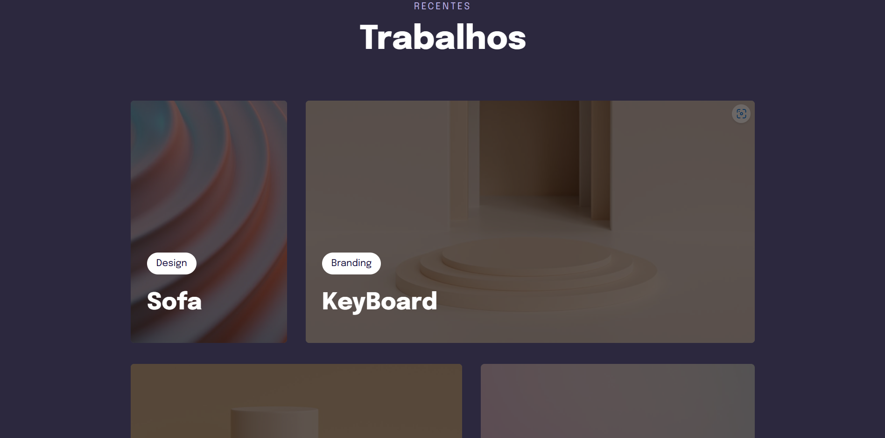

# 📚 Projeto Animações com CSS e Grid

[Acesse](https://prdsilva80.github.io/Projeto-05-Grid-/)

---

## 🛠️ Tecnologias 

  

---

## 👨‍🎓 O que aprendi

- Encaixando a imagem e sobrepondo o texto
- Transições e transformações
- Animações com o CSS
- Versão desktop com CSS Grid
- Usar filtros nas imagens com o CSS
- Ajustando textos com o Css Clamp

---

## 📧 Contato

<a href = "mailto:probertos717@gmail.com">