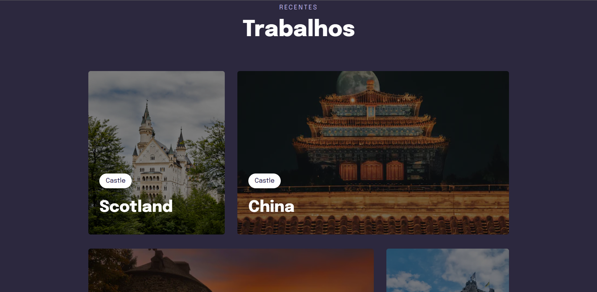

# 📚 Project Animations with CSS and Grid

[Acesse](https://prdsilva80.github.io/Projeto-05-Grid-/)

---

## 🛠️ Technologies 

  

---

## 👨‍🎓 What I learned

- Fitting the image and overlaying the text
- Transitions and transformations
- Animations with CSS
- Desktop version with CSS Grid
- Use filters on images with CSS
- Tuning texts with Css Clamp

---

## 📧 Contact

<a href = "mailto:probertos717@gmail.com">